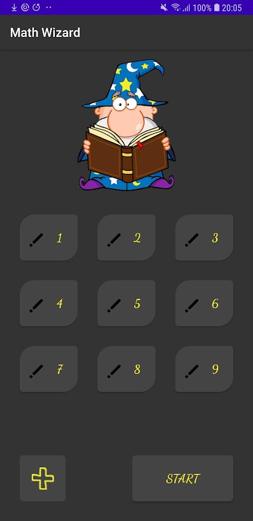
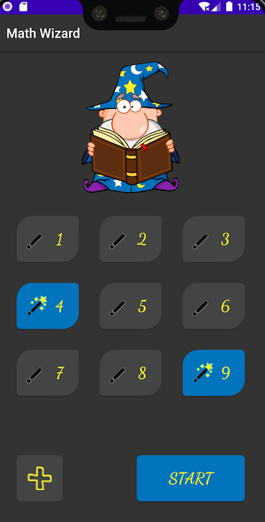
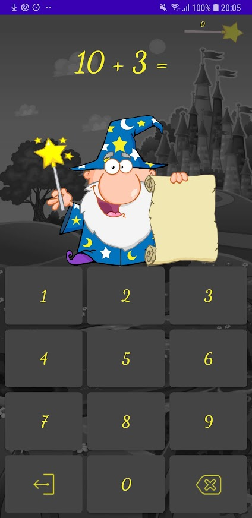
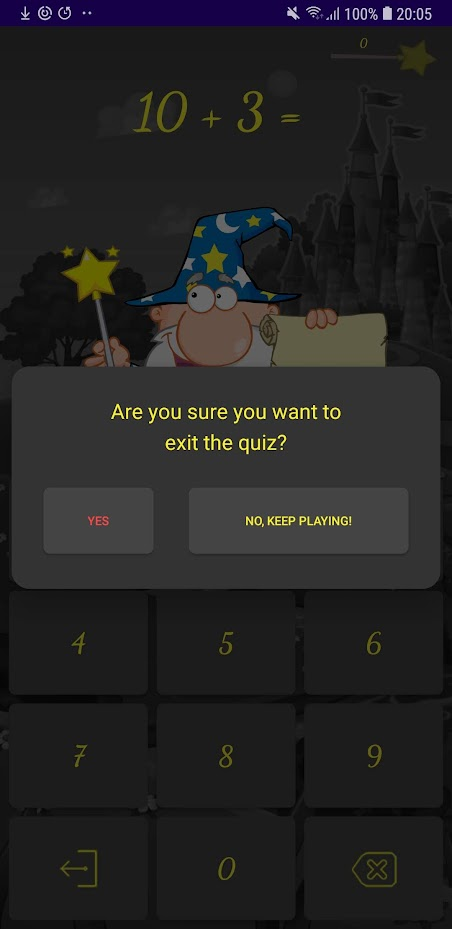

# Math Wizard

## About

A simple Android application that can help a toddler master basic mathematical operations (addition, subtraction, multiplication and division) via a gaming quiz.

The wizard gets (funnily) "angry" when the user gives correct answers, making kids laugh while learning.

It comes with a basic 3-star system, each quiz being awarded a number of stars based on the answers' accuracy and the time required for them.

## Screenshots

## Final notes

This is my first Android application, so there's definitely room for improvement. If it helps you, feel free to use the application and the code in any way you need.
